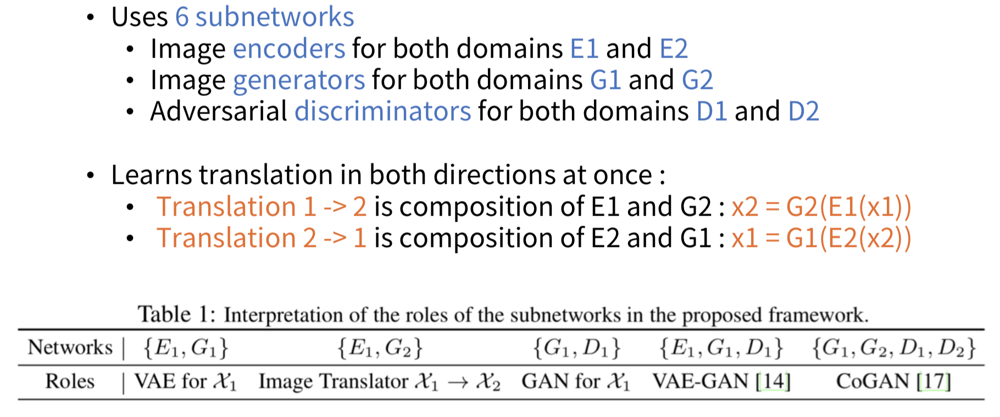
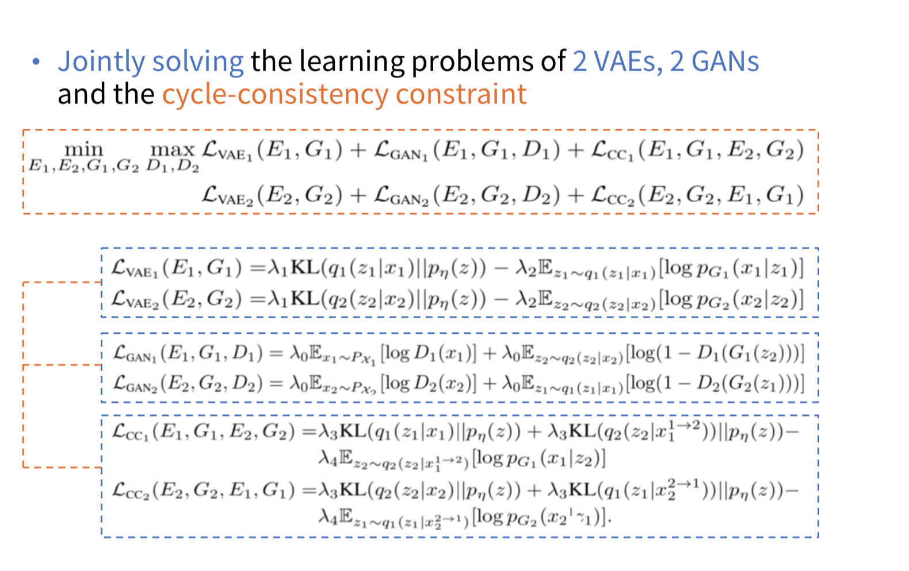

# UNIT-Tensorflow
Simple Tensorflow implementation of ["Unsupervised Image to Image Translation Networks"](https://arxiv.org/abs/1703.00848) (NIPS 2017)

## Usage
```bash
> python main.py --phase train --dataset cat 
```
* See `main.py` for other arguments

## Arichitecture


## Framework


## Model


## Training Objective


## Result
### Success


### Fail


## Reference
* [author-pytorch_code](https://github.com/mingyuliutw/UNIT)
* [slide](https://www.slideshare.net/MehdiELFASSYFIHRY/about-unsupervised-imagetoimage-translation)

## Author
Junho Kim
