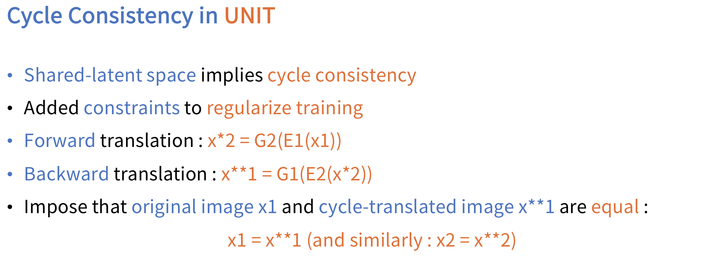

# UNIT-Tensorflow
Simple Tensorflow implementation of ["Unsupervised Image to Image Translation Networks"](https://arxiv.org/abs/1703.00848) (NIPS 2017)

## Requirements
* Tensorflow 1.4
* Python 3.6

## Usage
```bash
├── dataset
   └── YOUR_DATASET_NAME
       ├── trainA
           ├── xxx.jpg (name, format doesn't matter)
           ├── yyy.png
           └── ...
       ├── trainB
           ├── zzz.jpg
           ├── www.png
           └── ...
       ├── testA
           ├── aaa.jpg 
           ├── bbb.png
           └── ...
       └── testB
           ├── ccc.jpg 
           ├── ddd.png
           └── ...
```

```bash
> python main.py --phase train --dataset cat2tiger
```
* See `main.py` for other arguments

## Arichitecture


## Framework


## Model




## Training Objective


## Result
### Success


### Fail


## Related works
* [CycleGAN-Tensorflow](https://github.com/taki0112/CycleGAN-Tensorflow)
* [DiscoGAN-Tensorflow](https://github.com/taki0112/DiscoGAN-Tensorflow)

## Reference
* [UNIT-Pytorch](https://github.com/mingyuliutw/UNIT)

## Author
Junho Kim
