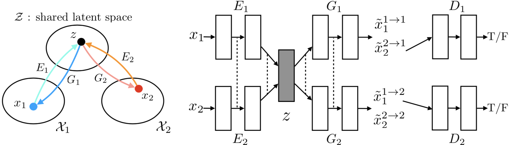
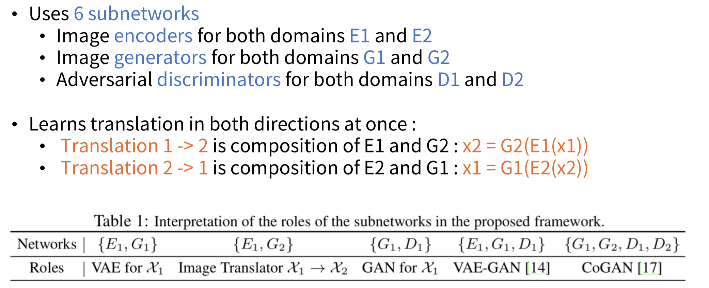
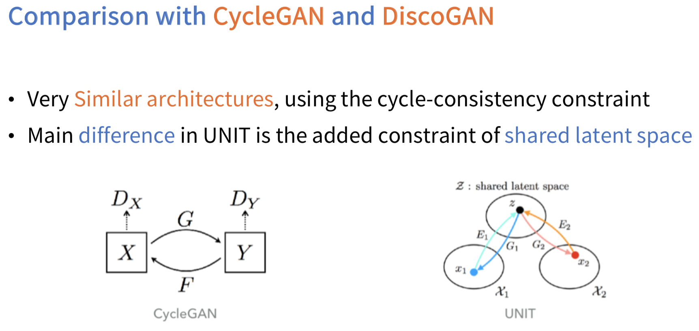
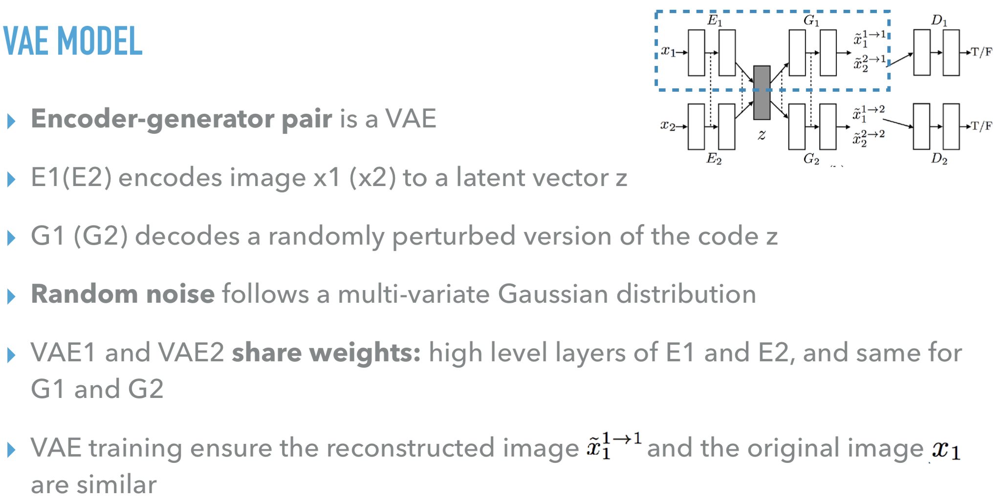
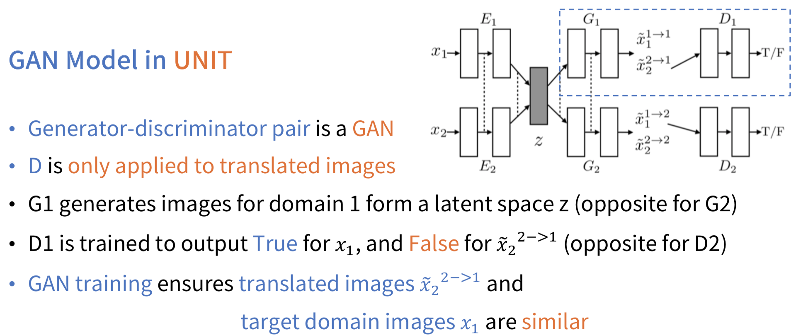
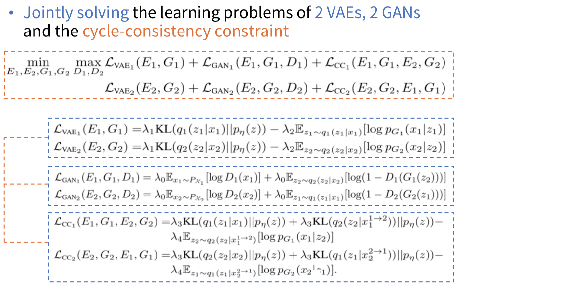
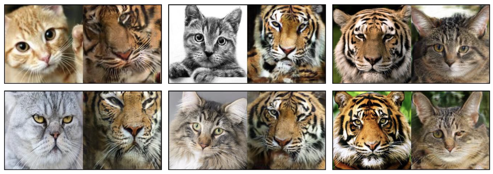

# UNIT-Tensorflow
Simple Tensorflow implementation of [Unsupervsied Image to Image Translation](https://arxiv.org/abs/1703.00848) (NIPS 2017)

## Arichitecture

## Framework

## Model

## Training Objective

## Result
### Success

### Fail

## Reference
* [author-pytorch_code](https://github.com/mingyuliutw/UNIT)
* [slide](https://www.slideshare.net/MehdiELFASSYFIHRY/about-unsupervised-imagetoimage-translation)

## Author
Junho Kim
